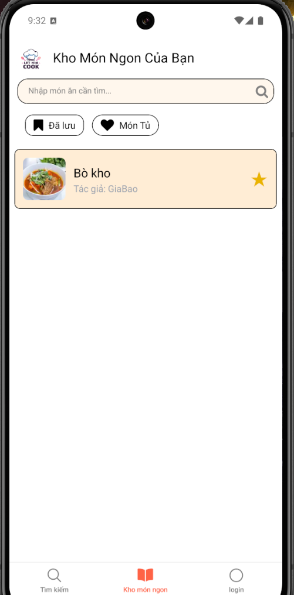
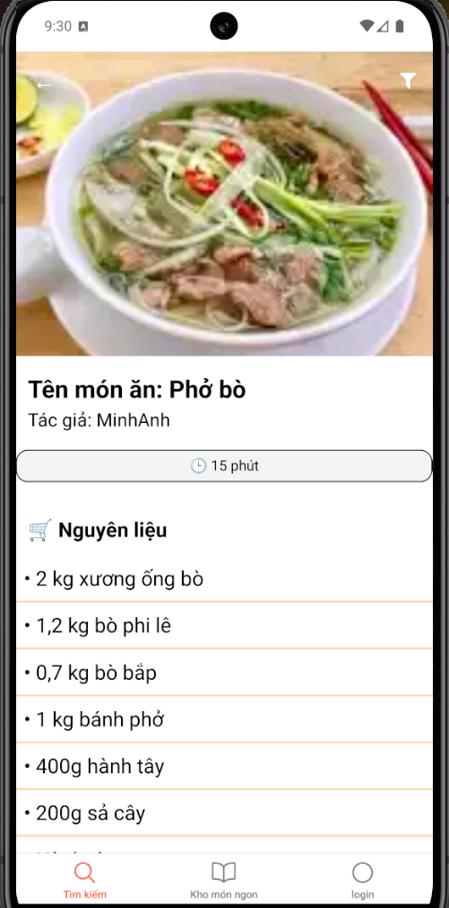

#  Ứng dụng Đa Nền Tảng Hướng Dẫn Nấu Ăn 

## 📱 Giới thiệu

**Ứng dụng Hướng Dẫn Nấu Ăn** là một ứng dụng đa nền tảng (cross-platform) được phát triển bằng **React Native**, giúp người dùng dễ dàng tìm kiếm công thức nấu ăn, xem hướng dẫn từng bước, lưu lại món ăn yêu thích và khám phá các món ăn phổ biến.

## 🎯 Mục tiêu

- Cung cấp trải nghiệm người dùng thân thiện và dễ sử dụng.
- Hỗ trợ người dùng nấu ăn tại nhà thông qua các bước hướng dẫn chi tiết.
- Cho phép người dùng đánh dấu và lưu lại công thức yêu thích.
- Hỗ trợ nền tảng Android và iOS từ cùng một mã nguồn.

## 🏗️ Kiến trúc dự án

Ứng dụng được tổ chức theo mô hình **MVC (Model - View - Controller)**, giúp dễ dàng bảo trì và mở rộng:

 - **controllers/:** Xử lý logic và điều hướng dữ liệu
 - **models/:** Định nghĩa dữ liệu và trạng thái
 - **views/:** Các giao diện người dùng
 - **services/:** Giao tiếp với API hoặc xử lý dữ liệu
 - **assets/:** Ảnh minh họa, icon,...
 - **App.js:** Điểm khởi đầu ứng dụng
## 🔑 Các tính năng chính

- 🔍 **Tìm kiếm công thức** theo tên món ăn, nguyên liệu,...
- 📋 **Xem chi tiết công thức** với danh sách nguyên liệu, thời gian, cấp độ, ảnh minh họa,...
- 👨‍🍳 **Hướng dẫn từng bước nấu ăn**, có nút “Tiếp theo” và “Quay lại”
- ❤️ **Yêu thích món ăn**, lưu lại công thức đã thích
- 🧑‍🍳 **Trang Bếp Yêu Thích**: tổng hợp các công thức đã lưu
- 🍴 **Gợi ý món ăn tương tự** dựa trên nguyên liệu hoặc thể loại


## 🛠️ Công nghệ sử dụng

| Công nghệ        | Vai trò              |            
|------------------|-----------------------------------|
| React Native     | Xây dựng giao diện người dùng |    
| React Navigation | Điều hướng giữa các màn hình  |   
| AsyncStorage     | Lưu trữ cục bộ dữ liệu yêu thích |
| JavaScript  | Ngôn ngữ lập trình chính       |   
| MVC Architecture | Quản lý mã nguồn rõ ràng    |     
| NativeWind (Tailwind)  | Tạo giao diện theo chuẩn Tailwind CSS|
 React Native Reanimated| Tạo animation mượt mà                              |

## 📸 Một số ảnh minh họa
#   
#  
#  


## 🚀 Hướng dẫn chạy dự án

```bash
# Cài đặt thư viện
npm install
npm install react-native-vector-icons
npm install twrnc

# Chạy trên Android
npx react-native run-android

# Chạy trên iOS (yêu cầu máy Mac)
npx react-native run-ios